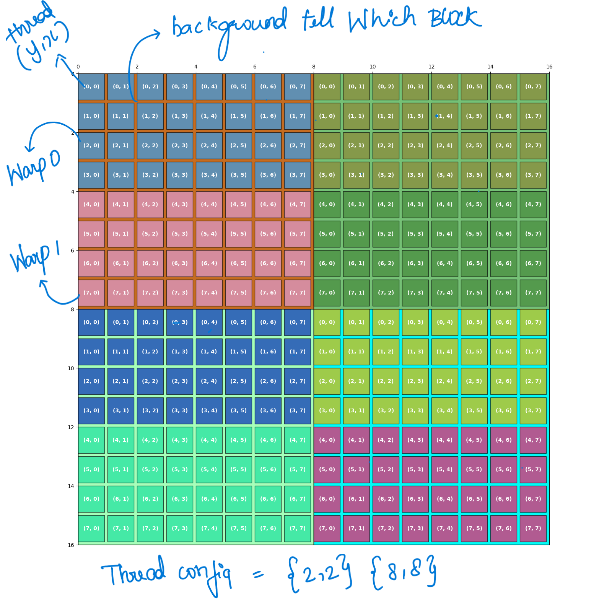
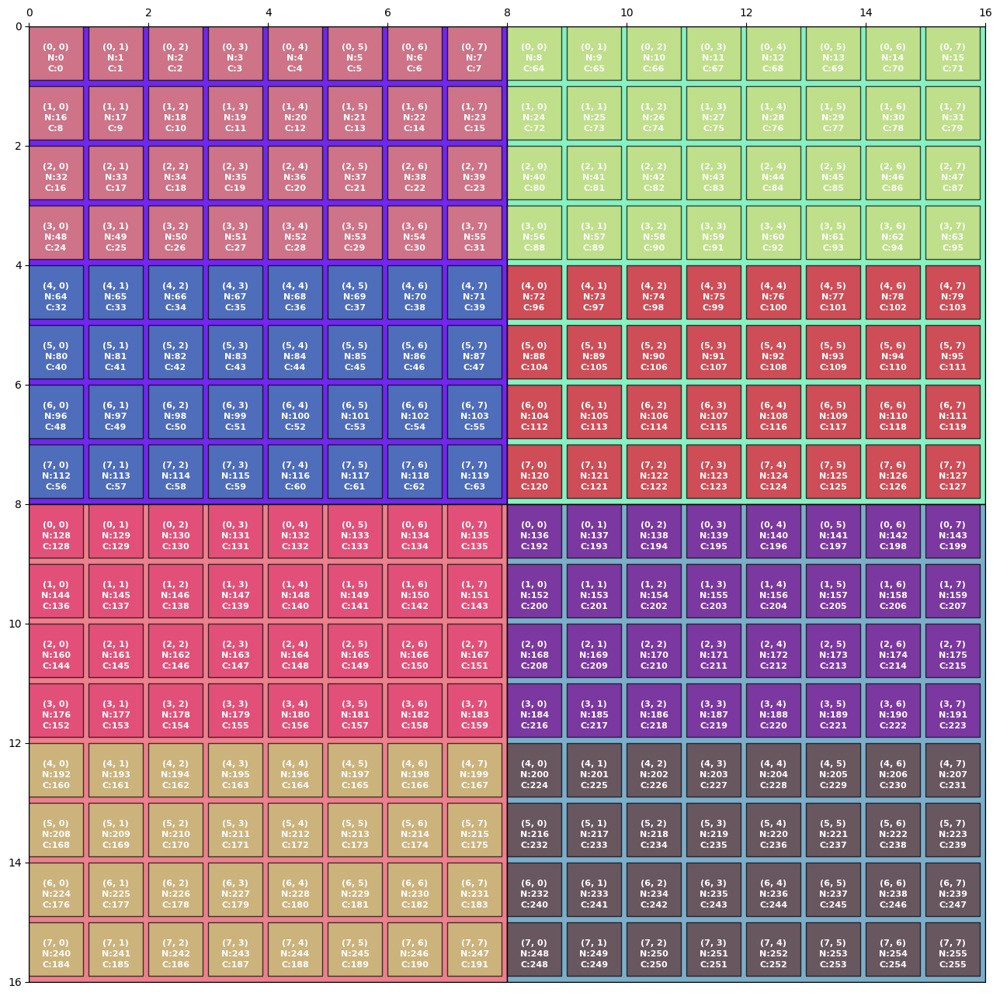

# CUDA Thread Organization Visualization

This Python script allows you to visualize the organization of CUDA threads within a GPU grid. It provides a visual representation of how threads are organized into blocks and grids, which can be useful for understanding and optimizing your CUDA applications. 

## Prerequisites

- Python 3.x
- Matplotlib library (install with `pip install matplotlib`)
- Pandas library (install with `pip install pandas`)

## Usage

1. Clone this repository or download the `cuda_thread_visualizer.py` script.

2. Open a terminal and navigate to the directory where the script is located.

3. Run the script with the following command:

   ```bash
   python cuda_thread_visualizer.py
   ```

   By default, this will generate an image file (`./asset/out_2x2_8x8.png`) with a visualization of a CUDA grid and block.

4. You can customize the visualization by providing optional command-line arguments:

   - `--grid_dim_x` (int): Number of grid elements in the x-direction (default: 2).
   - `--grid_dim_y` (int): Number of grid elements in the y-direction (default: 2).
   - `--block_dim_x` (int): Number of block elements in the x-direction (default: 8).
   - `--block_dim_y` (int): Number of block elements in the y-direction (default: 8).
   - `--out_filename` (str): Output file name for the visualization image (default: "./asset/out_{grid_dim_x}x{grid_dim_y}_{block_dim_x}x{block_dim_y}.png").

   Example with custom parameters:

   ```bash
   python cuda_thread_visualizer.py -gx 2 -gy 2 -bx 8 -by 8 -o custom.png
   ```

## Sample Image

Below is a sample image that visualizes the organization of CUDA threads within a GPU grid and block. In this image, color codes are used to represent the organization of threads, warps, and thread indices within each block.

- **Grid Size**:
  - Number of blocks in the x-direction: 2
  - Number of blocks in the y-direction: 2

- **Block Size**:
  - Number of threads in the x-direction: 8
  - Number of threads in the y-direction: 8

- **Color Codes**:
  - Each block is represented by a unique background color.
  - Within each block, individual squares represent threads.
  - Thread Y and Thread X coordinates are indicated within each thread square.
  - Thread squares are color-coded to represent warps.



- **Naive Global ID to Matrix Mapping**:
  - Threads' global IDs are mapped to a matrix, where each row represents a block, and within each block, threads are organized in rows and columns.
  - This mapping simplifies the understanding of how threads access elements in a matrix-like structure.

- **Coalesced Memory Access**:
  - Achieving coalesced memory access is vital for optimizing GPU memory operations.
  - The formula for calculating the global ID in a matrix to ensure coalesced memory access within a warp is:
    - ```python
      global_block_id_in_grid * total_threads_in_block + thread_id_within_block
      ```
  - Coalescing memory accesses within a warp means that each thread in the warp accesses the next adjacent element in the matrix.
  - Coalesced access patterns improve memory bandwidth utilization, enhancing overall performance in CUDA applications.



This image provides a visual representation of CUDA thread organization using color codes to illustrate the block structure, thread indices, and warp organization. You can use the script to generate your custom visualizations with different grid sizes and block sizes as needed.


